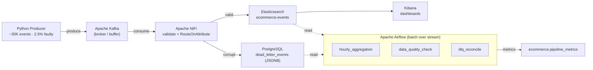

# E-Commerce Real-Time Data Pipeline

**A fully containerized streaming pipeline that ingests e-commerce events in real time, routes corrupt records to a dead-letter queue instead of dropping them, and fans out to Elasticsearch and Postgres — the whole stack comes up with a single `docker compose up --build`.**

> YZV 322E — Applied Data Engineering, Final Project · Team Enai · Istanbul Technical University

A Python producer simulates a Turkish e-commerce funnel (`page_view → product_click → add_to_cart → checkout_start → purchase`), pushing ~30,000 events to Kafka with data-quality faults injected at 2.5%. NiFi validates every event and routes it per-record: clean events go to Elasticsearch for real-time analytics, corrupt ones land in a Postgres dead-letter queue as `JSONB`. Airflow then runs batch DAGs on top of the streaming output. The result demonstrates **streaming ingestion**, **per-event failure isolation**, **multi-store fanout**, and **batch orchestration over a stream** — end to end, reproducibly.

## Architecture



## Tech stack

5 course tools + Kafka, each chosen for a specific role:

| Tool | Role | Why |
|---|---|---|
| **Apache Kafka** | Event broker | Decouples producer from consumers; durable buffer for backpressure |
| **Apache NiFi** | Stream processor | Visual pipeline with built-in failure routing — low-code DLQ pattern |
| **Elasticsearch** | Document store | Real-time search & aggregation over event analytics |
| **Kibana** | Dashboarding | Native ES integration for visualizations |
| **PostgreSQL** | DLQ + metrics + lookup | `JSONB` DLQ, time-series metrics, product catalog |
| **pgAdmin** | DB administration | Visual query/inspection during demo |
| **Apache Airflow** | Batch orchestration | DAG scheduling for aggregation, data quality, reconcile |

## Performance

Benchmarked at five producer rates, 10,000 events per run — **zero data loss at every rate**:

| Target rate | Producer actual | Pipeline throughput | Drain lag | ES indexed | DLQ | Loss |
|--:|--:|--:|--:|--:|--:|--:|
| 50 events/s | 49.50/s | 47.39/s | 9s | 9,710 | 290 | **0** |
| 100 events/s | 98.04/s | 89.29/s | 10s | 9,698 | 302 | **0** |
| 250 events/s | 238.10/s | 196.10/s | 9s | 9,701 | 300 | **0** |
| 500 events/s | 434.78/s | 312.50/s | 9s | 9,709 | 291 | **0** |
| 1000 events/s | 833.33/s | 476.19/s | 9s | 9,653 | 347 | **0** |

End-to-end latency (producer → indexed in ES) stayed under 2 seconds — mean **1.07s**, max **1.97s** (n=99, `bench/latency.csv`). Full throughput results in `bench/results.csv`; reproduce with `./scripts/benchmark.sh`.

## Quick start

Prerequisites: Docker Desktop (≥4.x), 16 GB RAM recommended, ~20 GB free disk.

```bash
# 1. Clone and enter
git clone https://github.com/muhammedabdullahozdemirr/e-commerce-real-time-data-pipeline.git
cd e-commerce-real-time-data-pipeline

# 2. Configure environment
cp .env.example .env

# 3. Download NiFi Postgres JDBC driver (one-time)
cd nifi/drivers && ./download.sh && cd ../..

# 4. Bring up the entire stack
docker compose up --build
```

First run takes ~5–10 minutes (image pulls); later starts ~60 seconds.

After startup, import the NiFi flow (`nifi/exported/NiFi_Flow.json`) via the NiFi UI (Operate panel → Upload Process Group), then enable the Airflow DAGs at `localhost:8081`. See `docs/PIPELINE_SETUP.md` for the full walkthrough.

## Service endpoints

| Service | URL | Credentials |
|---|---|---|
| Kafka UI | http://localhost:8090 | — |
| pgAdmin | http://localhost:5050 | from `.env` |
| NiFi | http://localhost:8080/nifi | from `.env` |
| Elasticsearch | http://localhost:9200 | — |
| Kibana | http://localhost:5601 | — |
| Airflow | http://localhost:8081 | from `.env` |

## Verifying the pipeline

After the producer finishes (~5 minutes):

```bash
./scripts/verify-pipeline.sh
```

Expected:

```
Elasticsearch ecommerce-events:    ~29,070 docs
Postgres dead_letter_events:       ~930 rows (null_user_id ~857, negative_price ~73)
Total processed:                   ~30,000 events
```

Quick SQL probe:

```bash
docker compose exec postgres psql -U ecom_user -d ecommerce \
  -c "SELECT error_type, COUNT(*) FROM ecommerce.dead_letter_events GROUP BY error_type;"
```

## Airflow DAGs

| DAG | Purpose | Output |
|---|---|---|
| `hourly_aggregation` | Aggregates last hour of ES events by city / device / event type, computes purchase revenue | 21 metrics → `pipeline_metrics` |
| `data_quality_check` | Computes DLQ-to-total ratio, alerts above 5% | 7 metrics → `pipeline_metrics` |
| `dlq_reconcile` | Classifies DLQ events as recoverable / reviewable / archivable (skeleton) | 5 metrics → `pipeline_metrics` |

All DAGs write structured key-value metrics to `ecommerce.pipeline_metrics`.

## Repository structure

```
.
├── dags/                        # Airflow DAGs (hourly_aggregation, data_quality_check, dlq_reconcile)
├── bench/                       # benchmark outputs (results.csv, latency.csv)
├── docker/pgadmin/              # pgAdmin server config
├── docs/
│   ├── data-schema.md           # event schema spec
│   └── PIPELINE_SETUP.md        # NiFi flow setup walkthrough
├── nifi/
│   ├── drivers/                 # Postgres JDBC driver (download.sh)
│   └── exported/NiFi_Flow.json  # importable NiFi flow
├── scripts/
│   ├── verify-pipeline.sh       # pipeline health check
│   ├── latency_probe.py         # end-to-end latency probe
│   └── benchmark.sh             # throughput / latency benchmark
├── sql/init/
│   ├── 01_schema.sql            # products, dead_letter_events, pipeline_metrics
│   └── 02_seed_products.sql     # seed product rows
├── src/producer/                # Dockerized Python event generator
├── tests/                       # pytest suite (data quality, schema)
├── docker-compose.yml
├── .env.example
└── README.md
```

## Known limitations

- **Single-broker Kafka** — no replication; academic demo only
- **Airflow on SQLite + SequentialExecutor** — one task at a time; production wants a Postgres backend with Local/CeleryExecutor
- **No NiFi Postgres lookup enrichment** — `product_brand` / `stock_level` / `is_featured` enrichment left as future work
- **`invalid_timestamp` events bypass the DLQ** — not yet routed by RouteOnAttribute
- **DAGs are not idempotent** — each run appends to `pipeline_metrics`; production would upsert or partition by date
- **Synthetic data** — approximates funnel ratios but lacks production edge cases

## Future work

- NiFi `LookupRecord` product enrichment from Postgres
- Airflow on Postgres backend with LocalExecutor
- Route `invalid_timestamp` events into the DLQ
- Real DLQ reconciliation logic in `dlq_reconcile`
- Multi-broker Kafka with replication
- Real-time alerting (Slack/email) on DQ threshold breach

## Team

Muhammed Abdullah Özdemir · Nurettin Macit · Muhammed Hasan Bilal Cebeci · Muhammed Furkan Şıhanoğlu

## License

MIT — see [LICENSE](LICENSE).
